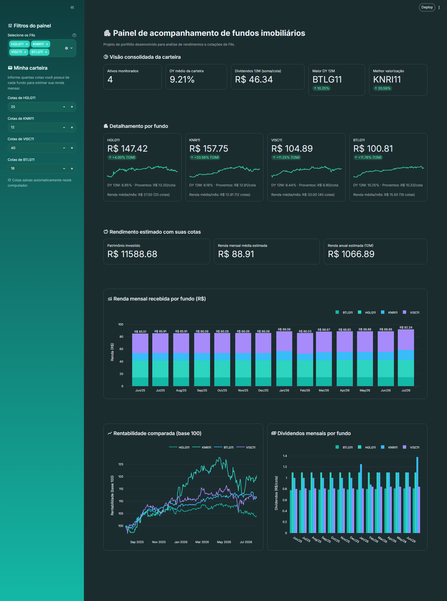

<div align="center">

# 📊 Dashboard de FIIs

**Painel interativo em Streamlit para acompanhar cotações, dividendos e rendimento de uma carteira de Fundos de Investimento Imobiliário (FIIs) da B3.**


</div>

<br>

<div align="center">
  
</div>

<br>

## Índice

- [Funcionalidades](#funcionalidades)
- [Como executar localmente](#como-executar-localmente)
- [Stack](#stack)
- [Estrutura do projeto](#estrutura-do-projeto)
- [Aviso](#aviso)
- [Licença](#licença)

## Funcionalidades

| | |
|---|---|
| 🔍 **Seleção flexível** | Escolha entre os FIIs padrão ou digite qualquer ticker novo direto na barra lateral. |
| 📈 **Visão consolidada** | DY médio, soma de dividendos, maior DY e melhor valorização da carteira. |
| 🏢 **Detalhamento por fundo** | Preço atual, variação de 12 meses, DY e proventos pagos por cota, com sparkline do histórico de preço. |
| 💰 **Rendimento estimado** | Informe a quantidade de cotas de cada fundo e o painel calcula patrimônio investido, renda mensal média e renda anual — salvos localmente entre sessões. |
| 📊 **Gráficos comparativos** | Rentabilidade normalizada (base 100) entre fundos e dividendos mensais por fundo, sem poluição visual. |
| 🎨 **Tema customizado** | Paleta teal definida em `.streamlit/config.toml`. |

## Como executar localmente

```bash
# 1. Clone o repositório
git clone https://github.com/marcelovitorls-rgb/dashboard-fiis.git
cd dashboard-fiis

# 2. Crie um ambiente virtual (opcional, recomendado)
python -m venv .venv
.venv\Scripts\activate      # Windows
# source .venv/bin/activate  # macOS/Linux

# 3. Instale as dependências
pip install -r requirements.txt

# 4. Rode o app
streamlit run app_dashboard_fiis.py
```

O app abre em `http://localhost:8501`.

## Stack

- [Streamlit](https://streamlit.io/) — interface e interatividade
- [yfinance](https://github.com/ranaroussi/yfinance) — extração de cotações e dividendos
- [pandas](https://pandas.pydata.org/) — tratamento e agregação de dados
- [Plotly](https://plotly.com/python/) — gráficos de rentabilidade e dividendos

## Estrutura do projeto

```
.
├── app_dashboard_fiis.py     # aplicação Streamlit
├── requirements.txt
├── docs/
│   └── screenshot.png
├── .streamlit/
│   └── config.toml           # tema visual customizado
└── minha_carteira.json       # gerado em runtime (não versionado) com as cotas informadas
```

## Aviso

Projeto para fins educacionais e de portfólio. Os dados vêm do Yahoo Finance e podem ter atraso ou imprecisões — não use como única fonte para decisões de investimento.

## Licença

Distribuído sob a licença MIT. Veja [LICENSE](LICENSE) para mais detalhes.
